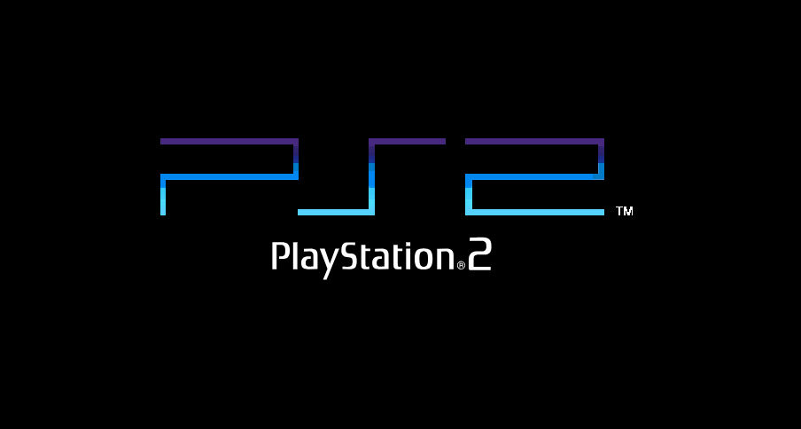

# PS2 Anniversary Tribute

<p align="center">
	
</p>

Ce dépôt contient un projet hommage à la PlayStation 2. L'objectif est de recréer l'ambiance visuelle et sonore du menu de la PS2.

<p align="center">
	
</p>

## Vue d'ensemble

Ce projet est essentiellement front-end mais il utilise quelques outils pour la compilation des ressources avec Sass et Pug.

## TechStack

La partie front-end est écrite en JavaScript vanilla sans framework front. Quelques bibliothèques peuvent être utilisées ponctuellement (ex. pour des animations), mais l'architecture favorise la simplicité en utilisant : 

- [Sass/Scss](https://sass-lang.com/)
- [Pug](https://pugjs.org/api/getting-started.html)
- JavaScript

## Pour commencer

### Prérequis

- Node.js (optionnel si vous n'utilisez pas les scripts de build de Sass et de Pug).

### Installation 

1. Cloner le dépôt :

```bash
git clone https://github.com/Squid-Nayth/ps2-anniversary-tribute.git
```

2. Installer Sass et Pug

Si vous souhaitez compiler les fichiers Sass localement pour contribuer au projet, installez `sass` globalement :

```bash
npm install -g sass
```

Pour utiliser `pug`, installez le paquet :

```bash
npm install pug
```

Remarque : certains workflows utilisent `npx` pour exécuter `sass` sans installation globale (ex. `npx sass ...`).

3. Lancer localement

Avec Node.js / serve :

```bash
npx serve public -l 8000
```

Ou utiliser l'extension [LiveServer](https://marketplace.visualstudio.com/items?itemName=ritwickdey.LiveServer) pour VsCode.


## Mentions légales

Les effets visuels et sonores présentés sur ce site sont la propriété de Sony Interactive Entertainment. Ce projet est réalisé à des fins non commerciales et n’est en aucun cas affilié à Sony.

---

## Licence

Ce projet est sous licence MIT.

